# Проект: Анализ резюме соискателей на платформе HeadHunter

## Оглавление
1. [Описание проекта](#описание-проекта)
2. [Задачи](#задачи)
3. [Используемые инструменты](#используемые-инструменты)
4. [Этапы работы](#этапы-работы)
5. [Визуализация результатов](#визуализация-результатов)
6. [Краткие выводы](#краткие-выводы)

---

## Описание проекта
В данном проекте проводится комплексный анализ базы данных резюме. Цель исследования — выявить закономерности в зарплатных ожиданиях кандидатов и подготовить данные для дальнейшего построения модели машинного обучения. Работа включает в себя трансформацию признаков, глубокую визуализацию и многоступенчатую очистку данных.

## Задачи
* **Исследование структуры данных:** Оценка типов признаков и наличия пропусков.
* **Преобразование данных:** Приведение валют к единому номиналу (рубли), расчет стажа, выделение ключевых характеристик (город, образование, готовность к переездам).
* **Визуальный анализ:** Изучение распределений и зависимостей с помощью гистограмм, коробчатых диаграмм и тепловых карт.
* **Очистка данных:** Удаление дубликатов, работа с пропусками и ликвидация выбросов (метод Z-отклонений и межквартильный размах).

## Используемые инструменты
* **Язык**: Python 3.x
* **Библиотеки**: 
    * `pandas`, `numpy` — обработка данных.
    * `plotly.express` — интерактивная визуализация.
    * `seaborn`, `matplotlib` — статическая визуализация и анализ распределений.

## Этапы работы

### 1. Подготовка и трансформация
* Создан признак «Опыт работы (месяц)» на основе текстового описания.
* Все зарплатные ожидания конвертированы в рубли по курсам валют на даты публикаций.
* Выделены признаки «Город», «Удаленная работа», «Готовность к переезду/командировкам».

### 2. Разведывательный анализ (EDA)
* Выявлена мода возраста соискателей (30 лет).
* Обнаружены критические аномалии (стаж 99 лет, зарплаты свыше 24 млн руб.).
* Установлена прямая корреляция между уровнем образования и медианной заработной платой.

### 3. Очистка данных
* Удален **161** полный дубликат.
* Заполнено **168** пропусков в стаже медианным значением (**114 месяцев**).
* Исключены логические ошибки (опыт больше возраста).

## Визуализация результатов
Так как GitHub не поддерживает интерактивные графики Plotly, основные результаты анализа представлены ниже в виде статических изображений (полные версии доступны в папке screenshots):

**Распределение признака "Возраст"**
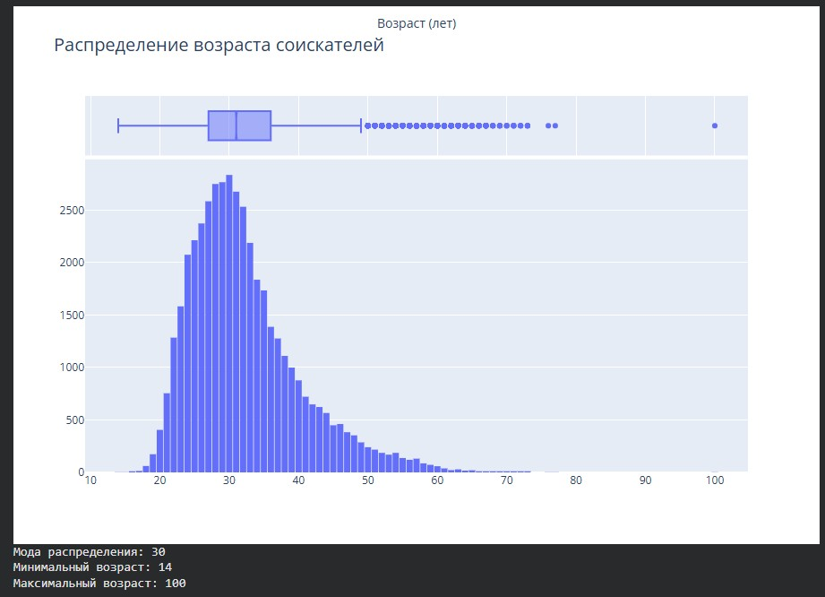

**Распределение опыта работы соискателей.jpg**
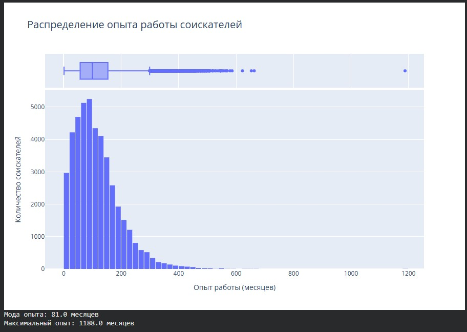

**Желаемая зароботная плата**
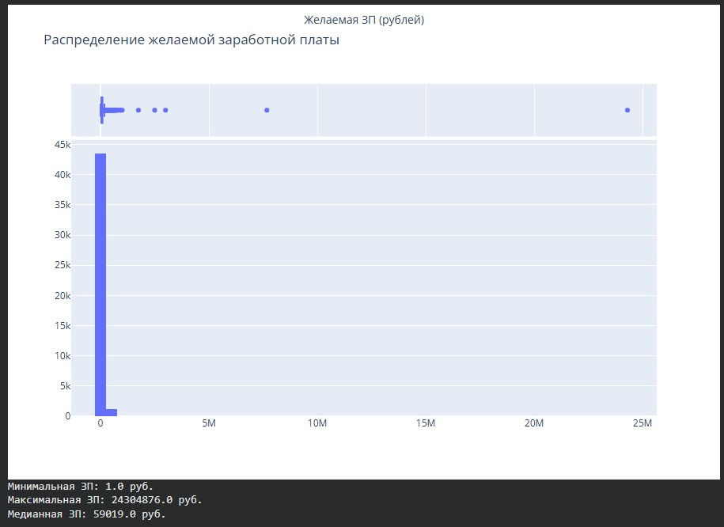

**Медианная желаемая ЗП - Образование**
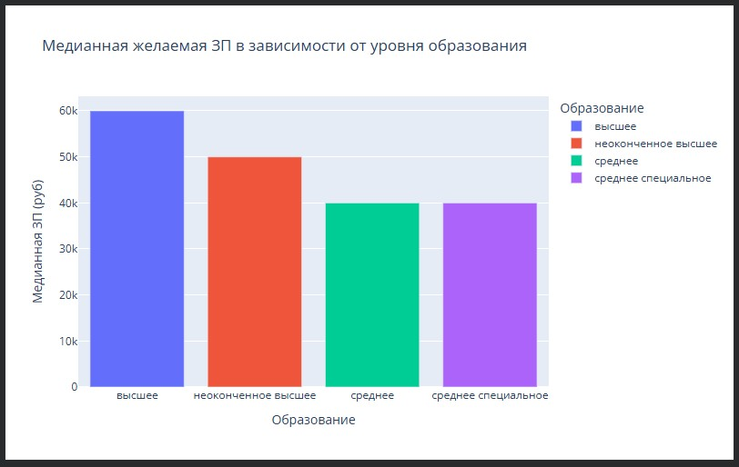

**Распределение желаемой ЗП по городам**
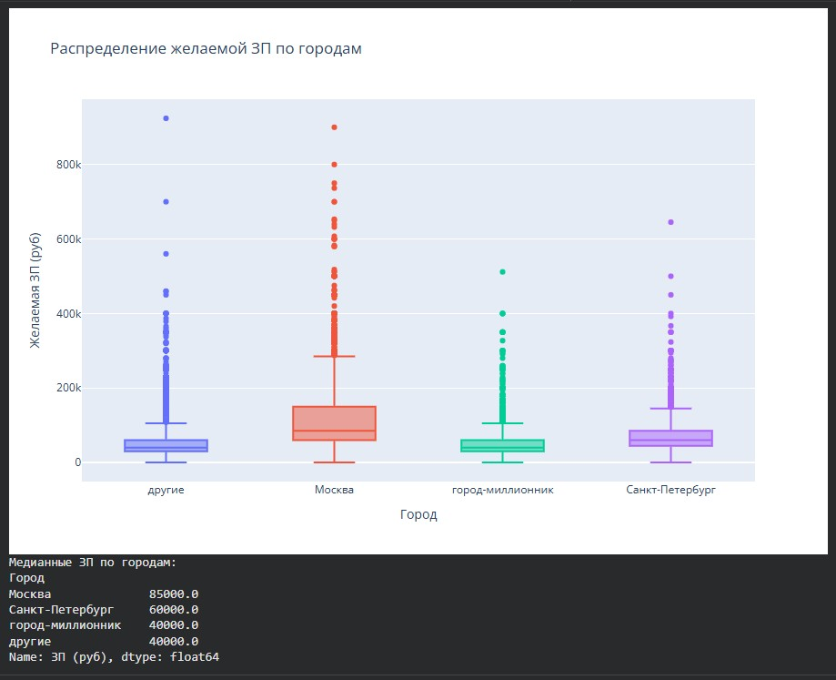

**Медианная ЗП в зависимости от готовности к переезду и командировкам**
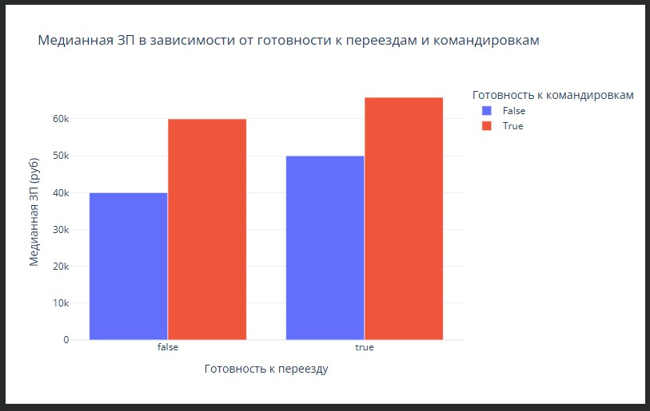

**Медианная ЗП возраст образование**
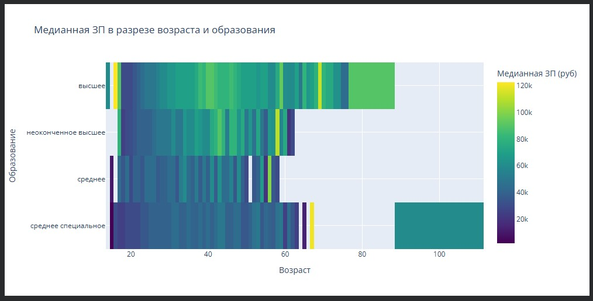

**Зависимость опыта от возраста**
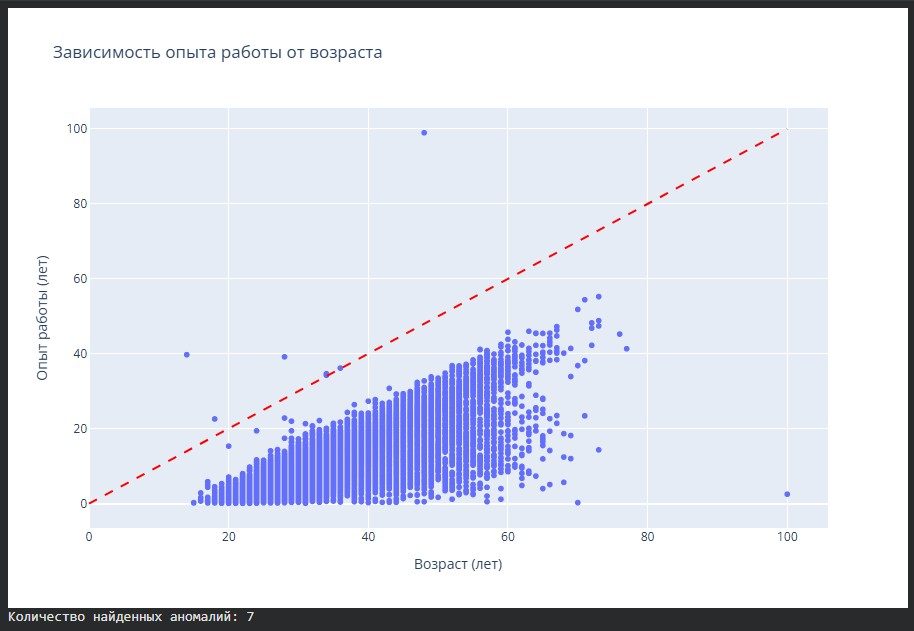

**Офис или удаленная работа**
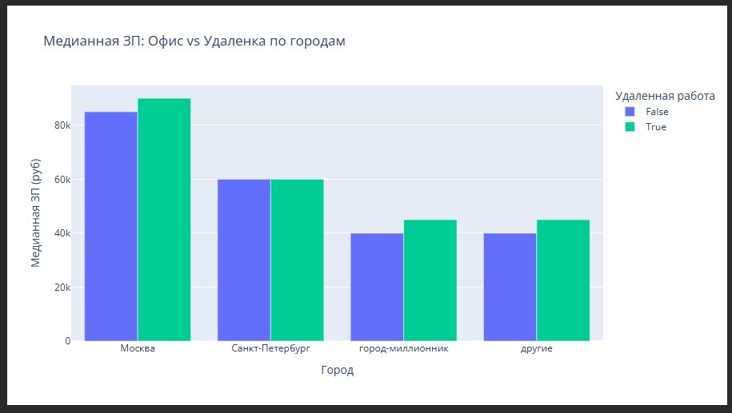

**Гендерный состав соискателей по образованию**
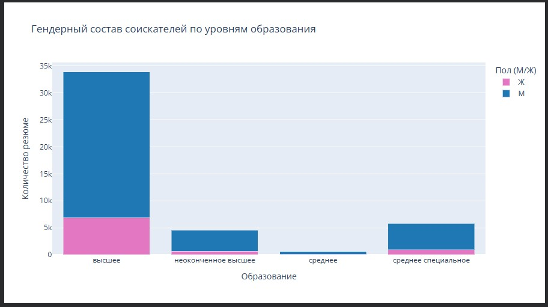

**Логарифмическое распределние возраста**
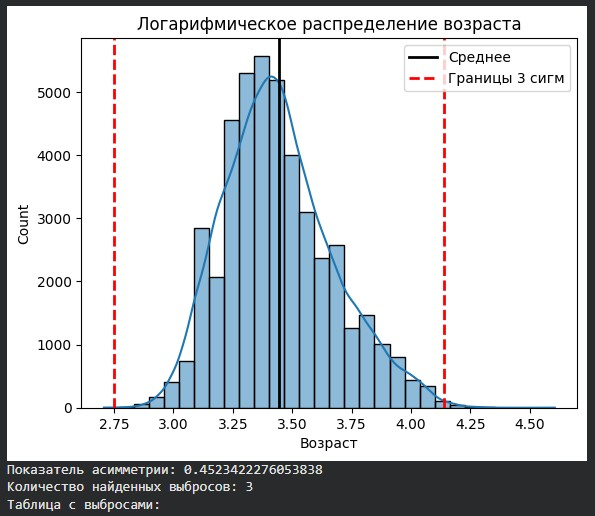

[Image of Data visualization dashboard layout]

## Краткие выводы
Анализ показал, что наиболее высокооплачиваемыми являются соискатели с высшим образованием, готовые к командировкам и переездам. Географический фактор играет ключевую роль: медианная ЗП в Москве значительно превышает показатели других регионов. Данные успешно очищены и готовы к этапу Machine Learning.

---

## Данные
Из-за ограничений GitHub по размеру файлов, исходный датасет (450 Мб) размещен на внешнем ресурсе.

**[СКАЧАТЬ ИСХОДНЫЙ ДАТАСЕТ В CSV](https://drive.google.com/file/d/1xVg4tVX9RT_VWjefA5JL25xkNuXmjzFm/view?usp=drive_link)**
